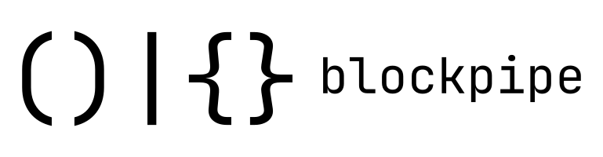

BlockPipe is an exploration of what could happen if the UNIX pipe operator was
generalized to operate on structured datatypes and functions, instead of text
streams and programs.

The structured datatypes, in turn, are generalizations of tuples (so we'll call
them tuples), and the functions shall be known as "blocks".

Blocks consume tuples and return tuples. They can be chained together using pipes. Hence - "BlockPipe".

## Grammar Overview
*Expression* $\rightarrow$ *Binding* | *Tuple* | *Block* | *Pipe* | *Literal* | *Identifier* | *TypeTuple* | *Paste*

*Binding* $\rightarrow$ *Identifier* **:** *Expression*

*Tuple* $\rightarrow$ **(** *Expression*\* **)**

*Block* $\rightarrow$ **{** *Expression*\* **}**

*Pipe* $\rightarrow$ *Expression* **|** *Expression*

*Literal* $\rightarrow$ *String* | *Integer* | *Float* | *Boolean*

*Identifier* $\rightarrow$ **(\[a-z]|\_)(\[a-zA-Z]|\_|\d)***

*String* $\rightarrow$ Standard C-style String

*Boolean* $\rightarrow$ **T | F**

*Float* $\rightarrow$ **\-?\d\+\\.\d\+**

*Integer* $\rightarrow$ **\d\+**

